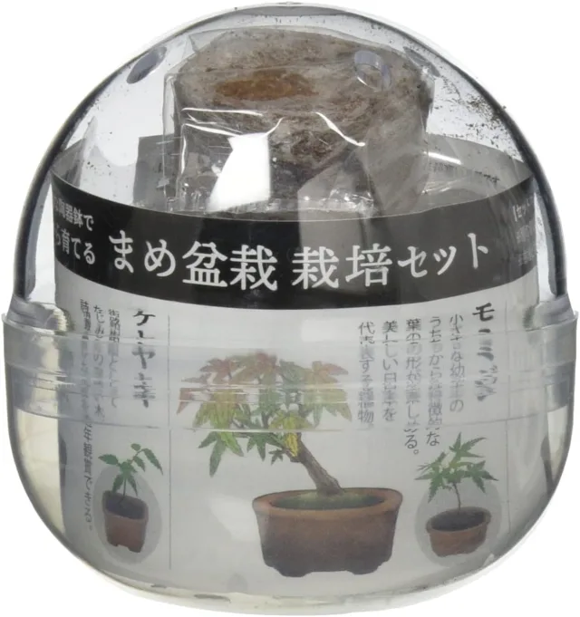
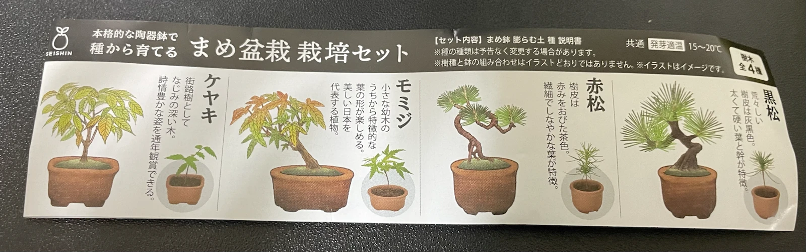
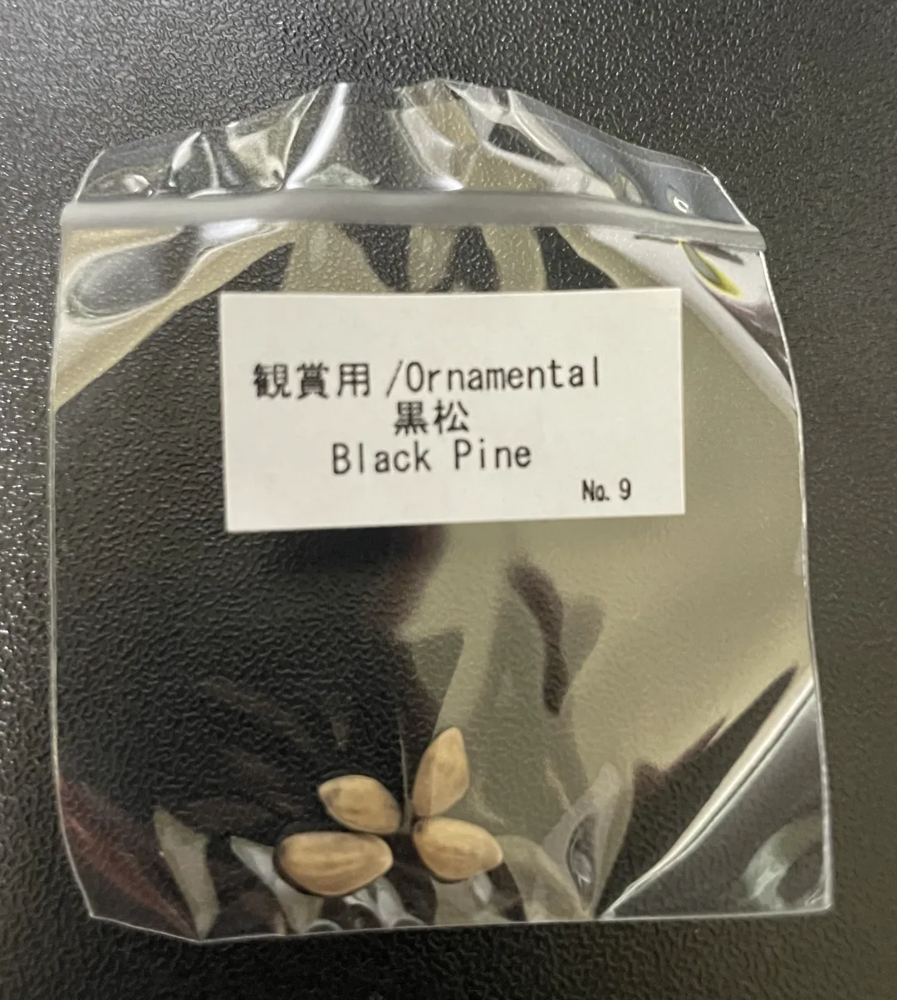
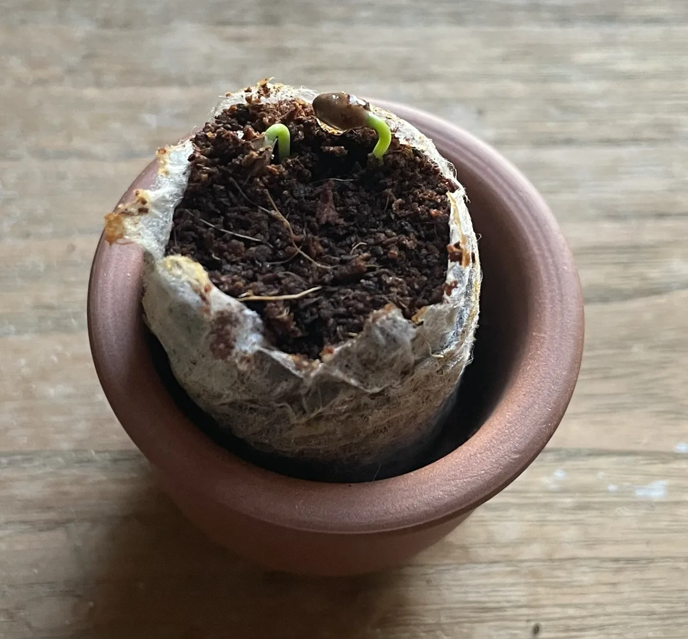

## はじめに

お出かけ先でこんなものを見つけて衝動買いしました。

機械ばっかり触ってると自然の生き物に触れたくなるのでしょう･･

## 何が出るかな

商品はカプセルに入っていて全部で4種類でした

お目当ては**黒松**ですが当てられる気がしません．．

と思ってたらでた！はっぴ〜

## 早速植えてみる

種と一緒にみに植木鉢と土が入っているので、早速植えてみました。（元気に育て〜）

## 発芽

約10日後、朝起きると新たな命が芽吹いていました！（かわいい）

さらに夜帰宅すると、横からもう1人！

## おわりに

500円のガチャガチャだったので、ちゃんと発芽するか心配でしたが元気に顔を出してくれました(^o^)

今後も観察日記をつけていけたらいいなと思ってます
