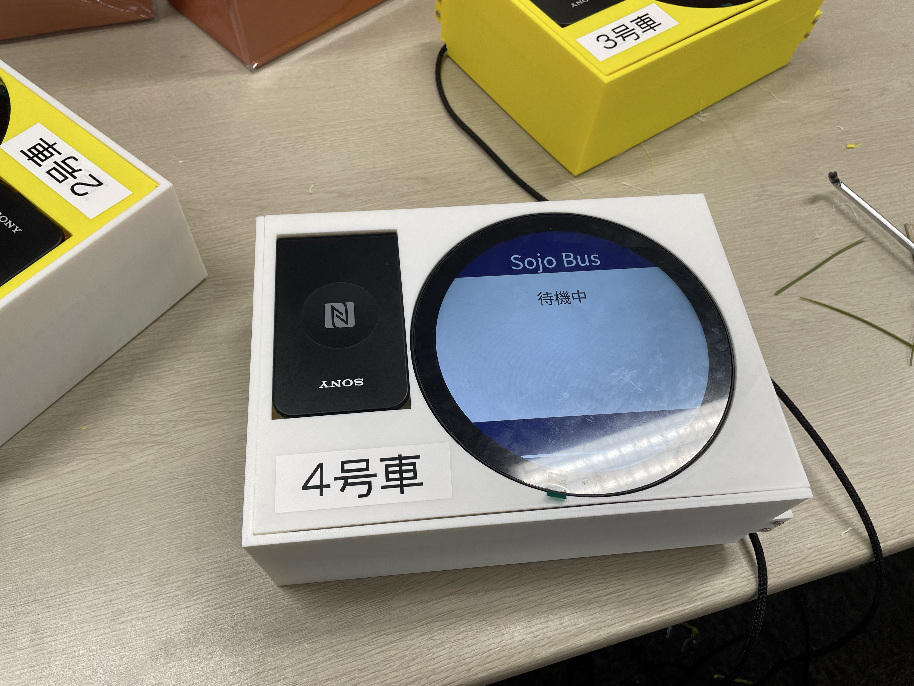
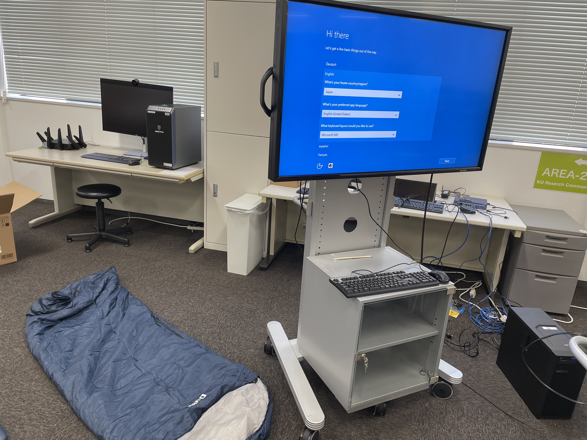

**期間:** 2023–2024

関西大学高槻キャンパスで運行されるシャトルバスの予約システムを開発しました。

## Background

大学ではこれまでシャトルバスが運行されておらず、新たな運行開始に合わせて予約システムを開発することになりました。乗車人数と座席を管理するため、学生がWeb上から希望する便と座席を予約し、乗車時に学生証で認証できる仕組みを構築しました。

## System

4台のバスに対して各20席の座席を管理します。学生はWebアプリから希望する便と座席を予約でき、予約情報はオンプレミスサーバー上に構築したFlask APIとデータベースで管理されます。

Webアプリと各バスに設置するRaspberry Piベースの認証機器は、Flask APIを通して予約情報を取得します。認証機器では、学生証から読み取った情報と予約情報を照合して乗車可否を画面に表示し、実際に乗車したことをデータベースへ記録します。

また、管理者用システムから予約情報や乗車状況を確認・操作できるため、シャトルバスの利用状況を一元的に管理できます。

## Card Reader

学生証による乗車確認のため、NFCリーダー、Raspberry Pi、表示画面を組み込んだタッチ認証機器を製作しました。学生証をかざすだけで予約状況を確認できるため、乗車時の確認作業を円滑に行えます。

## Development

システムの稼働基盤としてオンプレミスサーバーを構築し、現地でのセットアップと動作検証を行いました。

## Technology

Docker / Nginx / Python / Flask / Jinja2 / Ubuntu / Raspberry Pi
